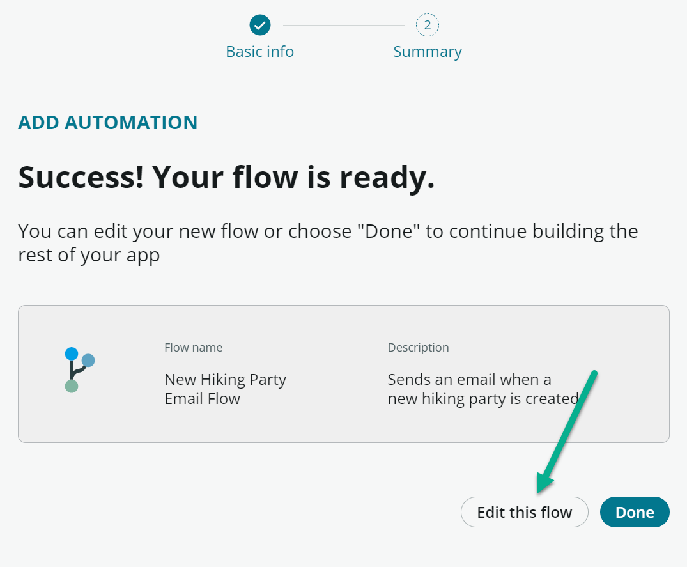
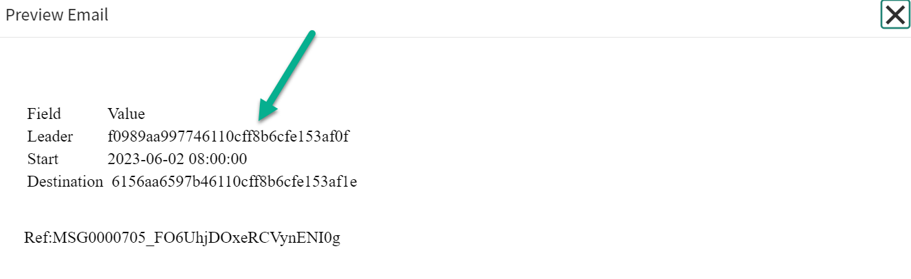

# CCL1193-K23 - Keep your players informed with notifications

## Goal

This lab will demonstrate how to utilize Flow Designer for sending email notifications. A variety of methods for sending these notifications will be discussed, including:

1. Sending an email through Flow Designer
1. HTML formatted emailing
1. Template based emails

# Exercise 1 - Using Flow Designer to Send Email

## Goal
In this exercise, we're going to send a plain text email to Gallagher Grey, alerting him that a new hiking party has been created.

## Creating a New Workflow ##

1. Open the **Hobble-a-Ton Hiking** application up in App Engine Studio.

    

2. Scroll down to the Logic and automation section and click **(+)Add** to create a new workflow.

    

    Click on "Flow"
    

3. We're going to build this one ourselves, so skip the templates and click **"Build from scratch"**.
   
    

1. Give your new flow a Name and a Description if the Flow needs more explanation and click **Continue**

    

2. The flow is now ready for action! Click on the **Edit Flow** button.

3. We only want this flow to run when certain things happen. These are called Trigger Conditions. Click Add a Trigger.

4. Fill in the following trigger fields
   
    | Field       | Value              |
    |-------------|--------------------|
    | Trigger     | Updated            |
    | Table       | Hike [x_151516_hobble_0_h1ke]     |
    | Condition   | Status changes to Approved |
    | Run Trigger | Once               |

    >Wizard's Tip: We are only triggering on the approval of the record, this process will only run one time because we have the Run Trigger drop down set to Once. We don't want to send multiple emails for the same record. Just in case!

5. Click **Done** to save the trigger conditions.
   
   
   

6. Click the **(+)** button to add an **Action**, **Flow Logic** or **Subflow** to your work flow.
   
    

7.  Click the **Action (1)** button and enter **Email (2)** into the search box.
    

8.  Find the action called **Send Email**. You will see a little **(i)** to the right of the action that will display more information about the action.

    

9.  A bunch of fields will now pop up. Don't worry, not all need to be filled in. We will use the data from the **Trigger - Record Created** data pill.
    

    | Field   | Value                                                                                                                    |
    |---------|--------------------------------------------------------------------------------------------------------------------------|
    | To      | ggrey@hobbleaton.com                                                                                                           |
    | Subject | A new hiking party has been created! |
    | Body    | See below  |
        Dearest Gallagher Grey, 
        We hope this electronic missive finds you in good health and spirits, as the dawn of a new journey awaits. We have recently forged a Hiking Party Request within the confines of our system, detailing the path and purpose of a forthcoming quest into the great outdoors.

        The time has come for you, a valued member of our company, to lend your discerning eye to this proposal of adventure. Your sagacity and experience shall greatly contribute to the success of the endeavor. Pray, review the Request, and share your thoughts and counsel.

        Yours in Fellowship,
        Hobble-a-Ton Hiking

    

10. Click **Done** to save the action.

11. Click **Save** at the top of the Flow Designer page to save your flow.

    >Wizard's Tip: Clicking the **Save** button is critical in this step, please don't forget it! 

12. At the top of our Flow, click the Test button.

    

13. Now select any Hiking Party. We're going to fake an approval so lets add some state variables to the Changed Fields dropdown.

    | Field       | Value              |
    |-------------|--------------------|
    | Field Name     | state            |
    | Previous Value       | 10     |
    | Current Value   | 11 |

    >Wizard's Tip: What this is actually doing is forcing the Hike record to be set to a state of **Requested (10)** and then immedately setting it to **Approved (11)** regardless of it's current state. In exercise 3, you'll see why this is handy.

    

14. Click the **Run Test** button at the bottom of the dialog window.

15. The **Test Flow** dialogue will now show a link that will open a new tab that has the detailed execution of the Flow. Use the scrollbars on the right to scroll to the bottom to find a link to the executions.

    

2.  The **Executions** tab shows the detailed output from the workflow so you can see what has happened.

    

3.  Lab instances don't actually send email, but that doesn't mean we can't see what it would have looked like! Sent emails are found in the email logs. Navigate back to the main system window and navigate to **System Logs > Emails**.

    

    You should be able to see the email that the system has just generated

    
    
    If you open the record, you can hit the Preview link
    

4.  Congratulations! If all has gone well, we're ready to activate our Flow. Switch back to the Flow Designer window and click the **Activate** button.

    >Wizard's Tip: Clicking the **Activate** button is just as important as clicking the **Save** button in the previous section. Many hours have been lost trying to figure out why a flow isn't working, only to find out it wasn't activated!

    Once your Flow is active, it will now send an email to Gallagher Gray anytime a new hiking party is created automatically!

    >**Extra Credit**: Instead of having this email sent to a single person, send it to a group instead. You can also add more data to the email so Gallagher Gray has more context.

# Exercise 2 - HTML formatted Emails

## Goal
In the previous section, we created a simple email using the data fields. In this section, we're going to build out an email that is sent to the Park Rangers whenever a hike misses their scheduled check-in. It will include an HTML formatted table that has all the data a Park Ranger needs to find the lost hikers.

## Create a new workflow

1. Open the **Hobble-a-Ton Hiking** application up in App Engine Studio.

    

2. Scroll down to the Logic and automation section and click **(+)Add** to create a new workflow.

    

1. Click on **Flow**
    

2. Just like before, we'll skip the templates and click **Build from scratch**.
    

3. Give your new Flow a Name and a Description if the Flow needs more explanation and click **Continue**

    

4. On the next screen click **Edit this flow** to open the workflow for editing.

    >Wizard's Tip: We need to make a small side quest here to add the Emergency state to the Hike table. 

5. Switch back to the **Hobble-a-Ton Hiking** App Home tab in App Engine Studio
    
    

6. Click the three dots next to the **Hike** table and select **Edit**
    
    

7. Time to edit the **State** field. Click the **Magnifying Glass** icon to pop up the search fields.
    

10. Type **state** into the **Column Name** field and press **Enter**. This will filter our view down to only the field we care about working with.
    

11. Click the **State** link to edit the record
    

12. Click the **Choices** tab. It should be empty, don't panic! We're going to click the **New** button to add a new entry.

    

13.  In the form enter the following 

| Field      | Value                       |
|------------|-----------------------------|
| Label    | Emergency                     |
| Value      | 911                         |

> Wizard's Note: It's very important that the **Value** field be set to **911** here. We're going to be testing for this value later on. Usually I encourage creativity when naming variables, but this is a value that is explicitly set. Please set this as written.

14. Hit the **Submit** button.
    

15. Let's switch back to our Flow! Go ahead and completely close the **Emergency State** tab we just opened in our browser.

> Wizard's Tip: If we had any other tabs open with our notification Flow in it from before, please make sure you either close those out or refresh them. We've added something new to the system (the Emergency state) and we need to tell it to go grab the new value. It's always better to refresh our tabs!

16. Switch back to your App Engine Studio tab in your browser. Scroll down and select the Flow we created in the previous step (Good thing you gave it a great name, right?). Click it to start editing.
    

17. Let's setup the trigger condition for our flow:

    | Field       | Value                       |
    |-------------|-----------------------------|
    | Trigger     | Updated                     |
    | Table       | Hiking Party                |
    | Conditions  | Status changes to Emergency |
    | Run Trigger | For each unique change      |

    >Extra Credit: We've set the Run Trigger to **For each unique change** think about why that is and what business scenerio we would want this. Is there any business cases in which we wouldn't want this to be set?

18. When you're ready, click the **Done** button

    

Like in the previous exercise, we're going to add an email action to our flow. But this time we're gonna spice it up with a snazzy table. 

19. Click the **Action** button and enter **Email** into the search box.
    

19. Find the action called **Send Email**. You will see a little **(i)** to the right of the action that will display more information about the action.

    
20. Click the **Send Email** item to add it to the **Actions** and begin adding data to the fields.
    

21. For the **To** box, enter **eeades@hobbleaton.com**, they're are Park Ranger.

>Wizard's Tip: In practice, we never want to assign tasks or send emails to just one single person. Humans like to do funny things like take vacations and get sick. 

>Extra Credit: Create a Park Ranger assignment group. Add Edgar Eades to the group. Then, create a new user and add them to the group as well. When you're done, have the emails send to the group instead of a single person. Do the emails send to each person in the group or one at a time (round robin)?

14. Set the **Subject** field to start with 
    >Lost Hiker Group Alert:&nbsp;  

    *Note the space at the end!*

15. On the right hand side of the Flow Designer window, find the pill labeled **Hike Record**. Click it to expose even more data we can use in our email.

16. Find the **Destination** pill and click it. This will open up all the data in the associated Destination record within the Hike record.

18. Click the **Name** pill and pull it over to the **Subject** line and let go of your mouse. It will automatically add itself to the end of your text!

19. In the **Body** field, click the **Table** button (it looks like a little grid). Then hover over **Insert table**. Another grid will pop up. We need a grid that is 2 columns wide and 4 rows deep.

    

20. Add the following to the table (include the header):

    | Field       | Value   |
    |-------------|---|
    | Leader      |   |
    | Start       |   |
    | Destination |   |

21. Pull each data pill over from the Hiking Group record and place it in the corresponding row. 

    

    >Wizard's Tip: The field for when the hike should start is called **Expected Start**. There are more fields that sound like they could work, they will be blank. Be careful!

22. Click **Done** and then **Save** the Flow. Let's test this bad boy out!

23. Click the **Test** button at the top of your flow.
    
    

24. Find a Hike record in the dropdown and select it.

25. Click the **(+)** button to add some changed field data.
    

26. Add the following data to the fields so we can simulate a change in state.
     | Field       | Value              |
    |-------------|--------------------|
    | Field Name     | state            |
    | Previous Value       | 9     |
    | Current Value   | 911 |

>Wizard's Tip: This will automatically force the hiking record into a state of "In Progress" and then force it to transition to "Emergency" all within our test scenario!

27. Click **Run Test**

28. Let's see if our notification was sent. Switch back to the main window. In the left navigation pane, type **Emails**. Navigate to **System Logs > Emails** and you should be able to see the email that the system has just generated.

    

    You should be able to see the email that the system has just generated
    
    
    If you open the record, you can hit the Preview link because the code that we generated is not very easy to read!
    

    Hmm...This is a problem. Nobody is going to be able to shout this into the forrest.
    

29. Head back to your Flow in App Engine Studio, you may have to close the Test Flow dialog box.
    
30. Remove the **Leader** and **Destination** pills that we set earlier, they're returning what we call a sys_id instead of the names we want. At this point, your email should look like this.
    

31. On the left hand side, open the pill for the **Hike Record > Lead Hiker** pill. Drag the **Name** pill over to the **Leader** row.
    

32. Do the same for the **Destination** using the **Hike Record > Destination** pill. Drag the **Name** pill over to the table to fill in Destination name.

23. Time to test our Flow again! Click the **Test** button at the top of your flow.
    
    

24. Find a Hike record in the dropdown and select it.

25. Since we're already done this dance once before, our Changed Fields should still be populated.
    

27. Click **Run Test**

1.  Switch back to the main window. In the left navigation pane, type **Emails**. Navigate to **System Logs > Emails** and you should be able to see the email that the system has just generated.

    

    You should be able to see the email that the system has just generated
    

    >Wizard's Tip: We want to select the newer email, not the older email. Check the **Created** field if you're not sure!
    
    Once again, let's click the preview link so we can take a look at the email we just generated.
    

    TA-DA! Beautifully formatted! Well, formatted at least. 
    

    >Extra Credit: Let's add some sparkle to this plain email template. Use Google, W3Schools, your own creativity and any other tool at your disposal to make this email special! Show me what you got!

# Exercise 3 - Using templates to send emails

## Goal
In this lab, we'll learn how to convert our email into a template so our notifications can easily be reconfigured when we share our app with the West Eros National Park.

Text and HTML emails are great, but when we want to share our apps with other parks (think another company installing our app), we don't want to have our data or strings hardcoded directly into the emails. This is where templates come into the picture.

Templates allow us to combine HTML and data fields together to form rich emails, with standard headers, footers. Templates are associated with tables.

In this exercise, we're going to create a confirmation email to send to the lead hiker when they have signed up for a new hike. We could do this with Flow Designer but we're going to do this one old school.

1. Navigate into the main ServiceNow application and navigate to **System Notifications > Email > Template**

2. Click **New** to create a new email template
   
    | Field        |  Value |
    |--------------|--------|
    | Name         | A good name for this template **Hiker Welcome Email** would be a great choice|
    | Table        | x_151516_hobble_0_h1ke       |
    | Subject      |  A Wondrous Journey Awaits Thee, Valiant ${opened_by}  |
    | Message HTML |  See block below      |
    
        Dearest ${opened_by},

        In the land of vast wilderness and untamed beauty, it is with great pleasure that I, a humble servant of the realm of nature, welcome you to our cherished National Park. May this electronic missive find thee in good spirits and in anticipation of the grand adventure that lies ahead.

        As you embark upon this journey through the ancient trails, trodden by the very footsteps of time, the majesty of the natural world shall unfold before your very eyes. The National Park, a manifestation of the great tapestry of creation, awaits your arrival with bated breath, ready to reveal its secrets and wonders as you travel towards ${destination}.

        As the lead hiker, you shall guide thy fellow travelers, a fellowship of wanderers bound by a shared passion for the beauty of the wild. May the spirit of camaraderie guide you, as you traverse the hills and valleys, forests and meadows, a world where the harmony of life reigns supreme.

        On the morn of ${expected_start}, be prepared for the trials that the expedition may present. Equip thyself with the faithful tools of the wanderer: sturdy boots, garments fit for the elements, and provisions to sustain thy spirit. The way may be long and arduous, but the rewards are boundless.

        As you venture forth on this noble quest, may the wisdom of the wild be your compass, and the beauty of the land be your guiding star. We shall eagerly await news of your triumphant return, regaled with tales of wonder and discovery.

        Fare thee well, ${opened_by}, and may the wind be ever at your back.

        In the spirit of adventure and fellowship!
    >The ${xxx} are place holders for the data fields in the table associated with the template. You are able to dot walk through to the associated data. It is key to think about the data design when building out the table structures to take into account the different technologies available in ServiceNow. You can attach images to the template as well.

    

1. Click **Submit** to save the template.
    >Next we need to build the actual notification that will use the template. Notifications can be triggered to fire off automatically when a record is created / updated, or through a workflow. We are going to use a workflow in this example.

1. Click back into the Notification Template record we just created and scroll to the bottom. 

2. Click **New** to create a new **Notification** record.
   
   

3. Fill in the form with the following values:

    | Field       | Value   |
    |-------------|---|
    | Name      |   A name that reflects that notification. A great one would be **New Hike Created Welcome Email**|
    | Table       |  x_151516_hobble_0_h1ke |
    | When to Send > Send When         | Record inserted or updated  |
    | When to Send > Updated| Checked |

4. Add a condition to the **When to send** tab that will only send this email when the states changes to **Approved**.
    
    > This notification record tells the platform to send a new email every time a hike moves to the **Approved** state without using Flow Designer.

    > Wizard's Tip: We've left the Subject and Message fields blank. These will automatically populate from our template. If you enter any value in these fields here, it will be overriden.

5. Switch to the **Who will receive** tab.
6. Click the **Lock** button next to **Users/Groups in fields**
   
7. Double click the **Lead Hiker** item so it is added to the **Selected** box and then click the **Unlock** button to save your selection.
   

8. Hit the **Submit** button to save your notification record.
   

    >Wizard's Tip: Since we're not using Flow Designer on this one, we're going to have to do this test manually and change the record ourselves. 

9. Switch back to our **App Engine Studio** view and click the **Preview** button next to the **Hike** entry in the **Data** group.
    

10. In the table view, find a **Hike** that is in the **Requested** state. Double click it to start editing it right in the list view. Select **Approved** in the dropdown provided. 
11. Click the green circle with the check mark to save your selection.
    

    >Wizard's Tip: The list editor is very powerful! But with great power comes great responsibility. As soon as you click the green button, your changes are saved and any Flows, business rules, workflows, etc. are kicked off. Do not pass go, do not collect $200.
1.  Switch back to the main window. In the left navigation pane, type **Emails**. Navigate to **System Logs > Emails**. Within the list, you should be able to see the email that the system has just generated. Click into the record to view it.
    

2.  Let's click **Preview Email** so we can see what it looks like
   

3. Congratulations! Up pops a nicely formatted email based on the template we created above!
   